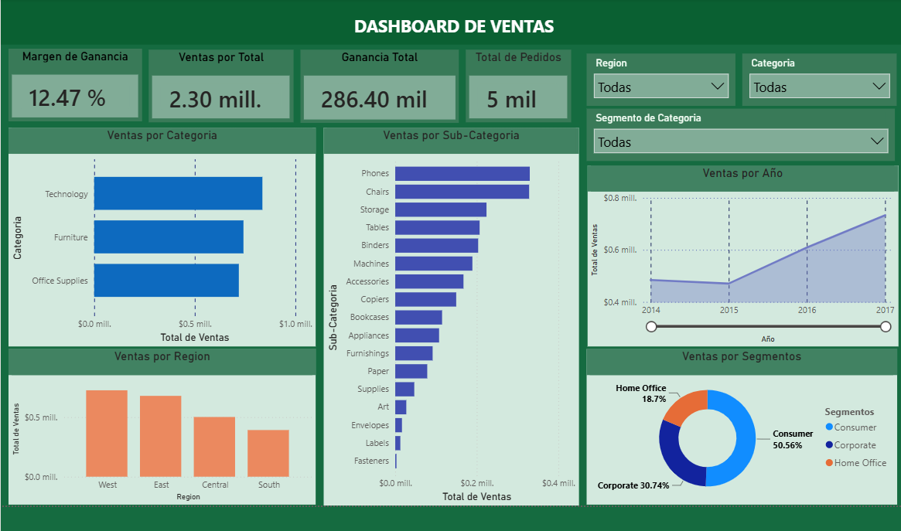

# Dashboard Comercial de Ventas

## Descripción

Este proyecto consiste en el desarrollo de un dashboard comercial interactivo en Power BI para analizar el desempeño de las ventas de una empresa.

El proceso comenzó con un conjunto de datos en formato CSV, el cual fue importado a Excel y transformado mediante Power Query para realizar la limpieza y preparación de los datos. Posteriormente, el archivo de Excel limpio fue utilizado como fuente de datos en Power BI para construir el dashboard y analizar indicadores comerciales.

---

## Objetivos

- Analizar el comportamiento de las ventas.
- Identificar las regiones con mejor desempeño.
- Evaluar las categorías y subcategorías más vendidas.
- Analizar el rendimiento por segmento de clientes.
- Facilitar la toma de decisiones mediante indicadores visuales.

---

## Herramientas utilizadas

- Power BI
- Excel
- Power Query

---

## Flujo del proyecto

CSV → Excel (Power Query) → Power BI

---

## KPIs incluidos

- Total de ventas
- Total de ganancias
- Cantidad de pedidos
- Margen de ganancia

---

## Visualizaciones

- Ventas por región
- Ventas por categoría
- Ventas por subcategoría
- Ventas por segmento
- KPIs comerciales
- Segmentadores interactivos

---

## Archivos del proyecto

- `Dashboard-Comercial-Ventas.pbix`
- `Dashboard-Comercial-Ventas-Datos.xlsx` *(datos limpios mediante Power Query)*
- `Dashboard-Comercial-Ventas-Datos.csv` *(dataset original)*

---

## Dashboard

> Captura del dashboard.

---

## Autor

**Aldahir Alexis Perez Cordero**

Data Analyst

- LinkedIn: https://www.linkedin.com/in/aldahir-perez-cordero-178b51361/
- GitHub: https://github.com/AlexisPerezCordero
